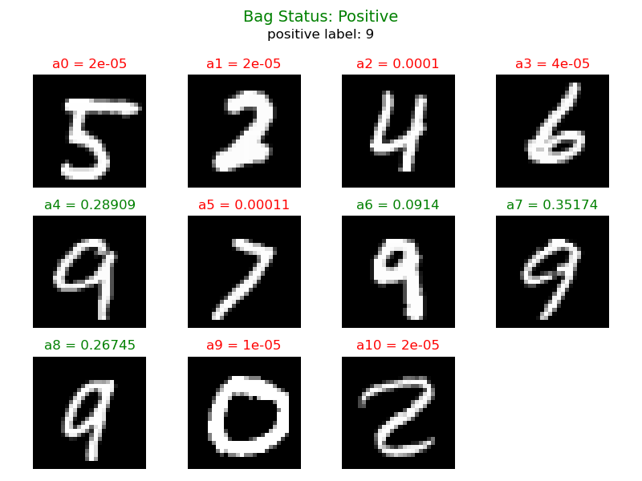

<!-- Improved compatibility of back to top link: See: https://github.com/othneildrew/Best-README-Template/pull/73 -->
<a id="readme-top"></a>
<!--
*** Thanks for checking out the Best-README-Template. If you have a suggestion
*** that would make this better, please fork the repo and create a pull request
*** or simply open an issue with the tag "enhancement".
*** Don't forget to give the project a star!
*** Thanks again! Now go create something AMAZING! :D
-->


<!-- PROJECT SHIELDS -->
<!--
*** I'm using markdown "reference style" links for readability.
*** Reference links are enclosed in brackets [ ] instead of parentheses ( ).
*** See the bottom of this document for the declaration of the reference variables
*** for contributors-url, forks-url, etc. This is an optional, concise syntax you may use.
*** https://www.markdownguide.org/basic-syntax/#reference-style-links
-->
[![MIT License][license-shield]][license-url]
[![LinkedIn][linkedin-shield]][linkedin-url]


<!-- PROJECT LOGO -->
<br />
<div align="center">
  <a href="https://github.com/othneildrew/Best-README-Template">
    
  </a>

  <h3 align="center">Attention-based Deep Multiple Instance Learning <br> & <br> MNIST-Bags</h3>

  <p align="center">
    <br />
    <a href="https://git.tu-berlin.de/cederic/attdmil/-/issues">Report Bug</a>
    ·
    <a href="https://git.tu-berlin.de/cederic/attdmil/-/issues">Request Feature</a>
  </p>
</div>


<!-- TABLE OF CONTENTS -->
<details>
  <summary>Table of Contents</summary>
  <ol>
    <li>
      <a href="#about-the-project">About The Project</a>
      </ul>
    </li>
    <li>
      <a href="#getting-started">Getting Started</a>
      <ul>
        <li><a href="#installation">Installation</a></li>
        <li><a href="#dataset-curation">Dataset curation</a></li>
        <li><a href="#model-training">Model Training</a></li>
        <li><a href="#visualization">Visualization</a></li>
      </ul>
    </li>
    <li><a href="#usage">Usage</a></li>
    <li><a href="#license">License</a></li>
    <li><a href="#contact">Contact</a></li>
    <li><a href="#acknowledgments">Acknowledgments</a></li>
  </ol>
</details>


<!-- ABOUT THE PROJECT -->
## About The Project

This repository is part of our participation in the Machine Learning Project for the Winter Semester 2024/25. Our objective is to reconstruct the results presented in the paper "Attention-based Deep Multiple Instance Learning" by [Ilse et al. (2018)]. This work leverages an attention mechanism to enhance the performance of deep multiple instance learning (MIL), a paradigm widely used in weakly supervised learning scenarios.

The project is divided into three milestones, culminating in the successful replication of the paper's outcomes. This repository focuses on the progress achieved during the first milestone, which includes the following tasks:

1. Dataset Curation:
Preparation and preprocessing of datasets used in the original study to ensure compatibility with our implementation.
2. Data Visualization:
Exploration and visualization of the dataset to gain insights and validate its characteristics against the paper's specifications.
3. Model Prototyping:
Development of initial models, laying the groundwork for the implementation of the attention-based MIL approach.
4. Baseline Method Evaluation:
Implementation and assessment of the baseline methods outlined in the paper to establish a reference point for performance comparison.

This repository serves as a comprehensive resource for documenting our progress, including code, results, and insights gained during the replication process.

<p align="right">(<a href="#readme-top">back to top</a>)</p>


<!-- GETTING STARTED -->
## Getting Started

To get a local copy and replicate our experiments follow these simple steps. 

### Installation

* clone the repo
   ```sh
   git clone https://git.tu-berlin.de/cederic/attdmil.git
   ```

### Dataset curation

* to inspect the MNIST-Bags dataset run 
   ```sh
   python ./dev/attdmil/src/dataset/dataset.py
   ```

### Model Training

* for training just run
   ```sh
   python ./dev/attdmil/src/model/train.py
   ```

* create a Weights and Biases account to be able to execute the implemented grid search properly
   ```sh
   https://wandb.ai/site/
   ```

* you can define a specific train config in train.py
   ```sh
   sweep_config = {
        'method': 'grid',
        'metric': {
            'name': 'val/loss',
            'goal': 'minimize' 
            },
        'parameters': {
            'mean_bag_size': {
                'value': 10            # [10, 50, 100] fixed
            },
            'var_bag_size': {
                'value': 2             # [2, 10, 20] fixed   
            },
            'num_bags': {
                'values': [50, 100, 150]     # [50, 100, 150, 200, 300, 400, 500]
            },
            'mode': {
                'values': ['embedding', 'instance']     # ['embedding', 'instance']
            },
            'pooling_type': {
                'values': ['max', 'mean', 'attention', 'gated_attention']       # ['max', 'mean', 'attention', 'gated_attention']
            },
        }
    }
   ```

### Visualization

* for testing just run 
   ```sh
   python ./dev/attdmil/src/model/test.py
   ```

* change the "ckpt_save_path" to the desired run and still adjust the MILModelConfig 
   ```sh
  ckpt_save_path = "./logs/local_gpu/new_mu10/embedding_poolattention_mu10_var2_num50/checkpoints/best_ep=10_val_loss=0.5671.pt"  
   ```

* the visualizations of the attention weights are stored in
   ```sh
   ./logs/local_gpu/new_mu10/embedding_poolattention_mu10_var2_num50/misc
   ```

<p align="right">(<a href="#readme-top">back to top</a>)</p>


<!-- USAGE EXAMPLES -->
## Usage

The model enables you to do Multiple Instance Learning with different approaches. It allows you to do classification on bag lavel. The attention-based mechanisms provide the so called attention weights which serve as a form of interpretability.


<p align="right">(<a href="#readme-top">back to top</a>)</p>


<!-- LICENSE -->
## License

Distributed under the MIT License. See `LICENSE.txt` for more information.

<p align="right">(<a href="#readme-top">back to top</a>)</p>


<!-- CONTACT -->
## Contact

* Cederic Aßmann - cederic.assmann@campus.tu-berlin.de
* Friedrich Hagedorn - hagedorn@campus.tu-berlin.de
* Jakub Sliwa - j.sliwa@campus.tu-berlin.de


<p align="right">(<a href="#readme-top">back to top</a>)</p>


<!-- ACKNOWLEDGMENTS -->
## Acknowledgments

Helpful libraries and papers used in the project

* [WandB](https://wandb.ai/site)
* [Attention-based Deep Multiple Instance Learning Paper](https://arxiv.org/abs/1802.04712)


<p align="right">(<a href="#readme-top">back to top</a>)</p>


<!-- MARKDOWN LINKS & IMAGES -->
<!-- https://www.markdownguide.org/basic-syntax/#reference-style-links -->
[license-shield]: https://img.shields.io/github/license/othneildrew/Best-README-Template.svg?style=for-the-badge
[license-url]: LICENSE.txt
[linkedin-shield]: https://img.shields.io/badge/-LinkedIn-black.svg?style=for-the-badge&logo=linkedin&colorB=555
[linkedin-url]: https://www.linkedin.com/in/cederic-aßmann-41904322b/